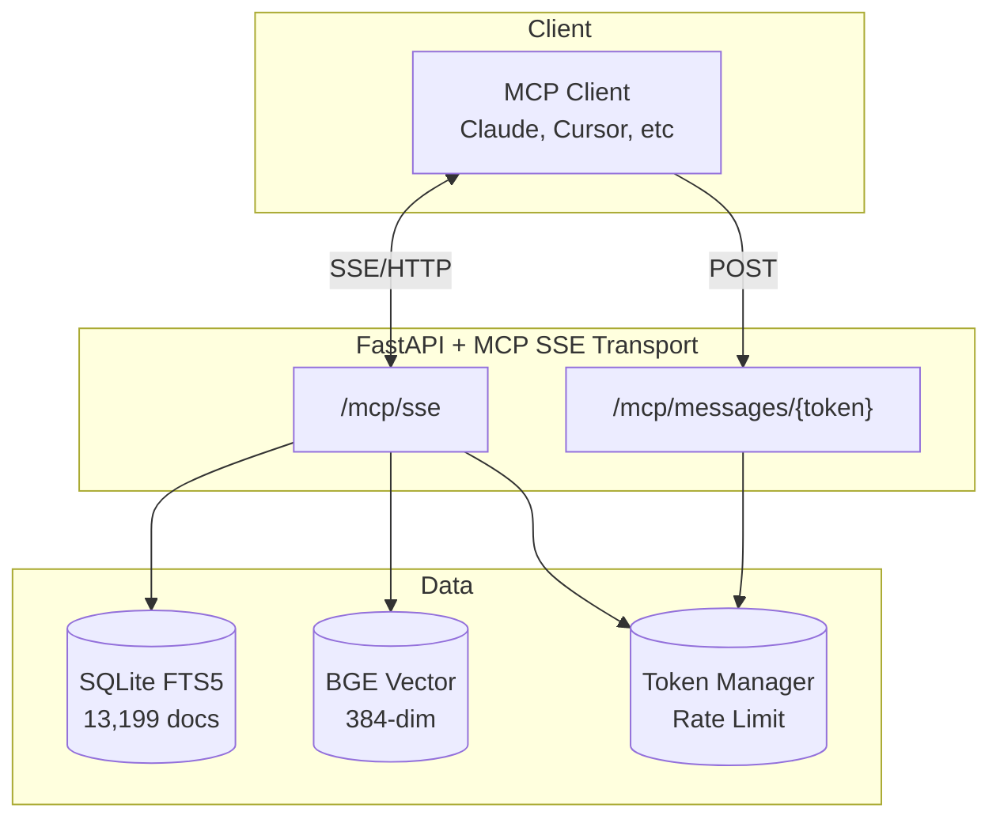

# Legislation Explorer MCP Server

Model Context Protocol (MCP) server providing semantic and structured access to Australian tax legislation, case law, ATO rulings, and commentary.

---

## Overview

The MCP server exposes legislation data through standardized MCP tools, enabling AI agents to query tax law programmatically. It uses Server-Sent Events (SSE) transport for HTTP compatibility and implements token-based authentication with rate limiting.

**Base URL:** `https://legislation.scriptkitty.yachts:8765`

---

## Architecture



### Data Inventory

| Collection | Documents |
|------------|-----------|
| ITAA 1997 | 4,638 sections |
| ITAA 1936 | 1,000 sections |
| GST Act 1999 | 827 sections |
| TAA 1953 | 1,288 sections |
| NZ IT 2007 | 3,295 sections |
| Commentary | 2,151 items |
| **Total** | **13,199** |

---

## Connection Endpoints

| Endpoint | Method | Description |
|----------|--------|-------------|
| `/mcp/sse` | GET | Establish SSE connection (requires valid token) |
| `/mcp/messages/{token}` | POST | Send tool invocation messages |

### Connection Flow

1. **Create token** via `/api/mcp-token` (authenticated with Bearer token)
2. **Connect SSE** to `/mcp/sse?token={your_token}`
3. **Send messages** via POST to `/mcp/messages/{token}`
4. **Receive responses** through SSE stream

---

## Authentication

### Token Creation

```bash
curl -X POST https://legislation.scriptkitty.yachts:8765/api/mcp-token \
  -H "Authorization: Bearer ${BEARER_TOKEN}" \
  -H "Content-Type: application/json" \
  -d '{
    "name": "my-client",
    "description": "Claude Desktop integration"
  }'
```

**Response:**
```json
{
  "token": "mcp_abc123xyz",
  "name": "my-client",
  "description": "Claude Desktop integration",
  "created_at": "2026-01-15T10:30:00Z",
  "last_used": null
}
```

### Token Management

| Endpoint | Method | Description |
|----------|--------|-------------|
| `/api/mcp-tokens` | GET | List all tokens |
| `/api/mcp-tokens/{token}/revoke` | POST | Revoke a token |

Tokens are SHA256-hashed in storage. The plaintext token is only returned once at creation.

---

## Rate Limiting

Token bucket algorithm with dual limits:

| Limit | Value | Scope |
|-------|-------|-------|
| Per-token | Configurable per token | Individual clients |
| Global | 1000 RPM | All MCP requests combined |

Rate limit headers returned on API responses:
- `X-RateLimit-Limit`: Maximum requests allowed
- `X-RateLimit-Remaining`: Requests remaining in window
- `X-RateLimit-Reset`: Unix timestamp when limit resets

---

## Available Tools

### 1. `search_legislation` — Hybrid Search

**What it does:** Combines full-text search (FTS5) and vector semantic search using Reciprocal Rank Fusion (RRF). Returns the best of both exact matching and semantic similarity.

**When to use:**
- General research on a tax topic when you don't know the exact section
- Finding relevant provisions based on a factual scenario
- Initial exploration before drilling into specific sections

**Parameters:**
```json
{
  "query": "capital gains on inherited property",
  "act": "itaa-1997",
  "limit": 10,
  "include_commentary": true
}
```

**Returns:** Ranked sections with relevance scores, content snippets, and optional commentary matches.

**Example workflow:**
1. User asks: "How are capital gains calculated on inherited property?"
2. Call `search_legislation` with query
3. Review results to identify relevant Div 104 events and s 128-15 (death and CGT)
4. Follow up with `get_section` for full text of specific provisions

---

### 2. `semantic_search` — Pure Vector Search

**What it does:** Pure vector similarity search using BGE-small-en-v1.5 embeddings. Finds conceptually similar content even without keyword overlap.

**When to use:**
- The user describes a scenario using different terminology than the Act
- Keyword searches return poor results
- Looking for related concepts that might use different words

**Parameters:**
```json
{
  "query": "selling shares that were a gift from parents",
  "act": "itaa-1997",
  "top_k": 10
}
```

**Returns:** Sections ranked by cosine similarity score (0-1).

**Example workflow:**
1. User describes a situation using lay terms: "I got given some stocks"
2. `semantic_search` finds s 130-80 (acquisition of shares as gift) despite no keyword match
3. Use `get_section` to retrieve full provision

---

### 3. `get_section` — Retrieve Specific Section

**What it does:** Returns the full content of a specific legislation section with auto-linked definitions, cross-references, and associated cases/rulings.

**When to use:**
- You know the exact section you need (from search results or citation)
- Drilling down into specific provisions after initial search
- Verifying the text of a section before quoting it

**Parameters:**
```json
{
  "act": "itaa-1997",
  "section": "s6-5"
}
```

**Returns:**
```json
{
  "frontmatter": {
    "title": "Ordinary income",
    "act": "Income Tax Assessment Act 1997",
    "section": "6-5"
  },
  "body": "Your *assessable income* includes income according to ordinary concepts...",
  "cases": [{"citation": "Scott v CT", "title": "..."}],
  "rulings": [{"citation": "TR 1999/17", "title": "..."}],
  "commentary": [...]
}
```

**Example workflow:**
1. Search identifies s 6-5 as relevant
2. Call `get_section` with act="itaa-1997", section="s6-5"
3. Body includes auto-linked definitions (e.g., *assessable income* links to definition)
4. Review associated cases and rulings for context

---

### 4. `list_acts` — Browse Available Acts

**What it does:** Returns a list of all available legislation acts and collections with metadata.

**When to use:**
- Starting a research task and need to see what's available
- Building a navigation interface
- Confirming the correct act ID for a query

**Parameters:** None

**Returns:** Array of acts including ITAA 1997, ITAA 1936, GST Act, TAA 1953, NZ IT 2007, plus Cases and Rulings collections.

**Example workflow:**
1. User asks about fringe benefits
2. Call `list_acts` to confirm act ID is "fbtaa-1986" not "itaa-1997"
3. Use correct act ID in subsequent searches

---

### 5. `get_act_tree` — Navigate Act Structure

**What it does:** Returns the hierarchical structure of an act: Parts → Divisions → Subdivisions → Sections.

**When to use:**
- Browsing the structure of an act to understand its organization
- Finding related sections within the same division
- Building a navigation tree for a UI

**Parameters:**
```json
{
  "act": "itaa-1997"
}
```

**Returns:** Nested tree with part titles, division numbers, and section IDs.

**Example workflow:**
1. User is researching international tax
2. `get_act_tree` on ITAA 1997 shows Div 815 is under Pt IV (International)
3. Identify all sections in Div 815 for comprehensive research

---

### 6. `get_definition` — Lookup Defined Terms

**What it does:** Retrieves the definition of a specific term from an act's dictionary (s 995-1 for ITAA 1997, s 6 for ITAA 1936, etc.).

**When to use:**
- Encountering a defined term in a section and need its precise meaning
- Checking if a term is defined (vs taking its ordinary meaning)
- Researching the scope of a definition that might affect multiple sections

**Parameters:**
```json
{
  "act": "itaa-1997",
  "term": "resident"
}
```

**Returns:** Definition text with source section reference and any exclusions/limitations.

**Example workflow:**
1. Reading s 6-5 which uses "resident" 
2. Call `get_definition` to see s 995-1 definition
3. Definition includes the four statutory tests (resides, domicile, 183 days, superannuation)

---

### 7. `get_commentary` — Research Commentary

**What it does:** Retrieves commentary articles from tax publications (Australian Tax Review, Taxation in Australia, etc.) related to a specific section.

**When to use:**
- Need deeper analysis beyond the legislation text
- Looking for commentary on how a provision operates in practice
- Finding academic or practitioner perspectives on interpretation

**Parameters:**
```json
{
  "act": "itaa-1997",
  "section": "s100A",
  "limit": 20
}
```

**Returns:** Commentary entries with publication, author, year, and excerpts.

**Example workflow:**
1. Researching s 100A (reimbursement agreements)
2. `get_commentary` returns articles from ATR and TIA on recent developments
3. Review commentary for interpretive guidance

---

### 8. `get_cases` — Find Case Law

**What it does:** Returns case law citations that reference a specific section.

**When to use:**
- Need judicial interpretation of a provision
- Looking for leading cases on a section
- Checking how courts have applied the law

**Parameters:**
```json
{
  "act": "itaa-1997",
  "section": "s6-5",
  "limit": 20
}
```

**Returns:** Cases with citations, titles, and links to full text where available.

**Example workflow:**
1. Researching ordinary income under s 6-5
2. `get_cases` returns *Scott v CT*, *Myer Emporium*, *FCT v Cooling*
3. Retrieve full case text for key authorities

---

### 9. `get_rulings` — ATO Guidance

**What it does:** Returns ATO rulings (Taxation Determinations, Rulings, etc.) that reference a specific section.

**When to use:**
- Need the ATO's administrative view on a provision
- Checking compliance requirements
- Understanding ATO audit focus areas

**Parameters:**
```json
{
  "act": "itaa-1997",
  "section": "s6-5",
  "limit": 20
}
```

**Returns:** Rulings grouped by year and type with citations and titles.

**Example workflow:**
1. Researching forex gains under Div 775
2. `get_rulings` returns TD 2024/5, TR 2023/1, etc.
3. Review rulings for ATO compliance guidelines

---

## Hybrid Search Algorithm

The `search_legislation` tool uses Reciprocal Rank Fusion (RRF) to combine FTS and vector results:

```python
# RRF formula: score = Σ 1/(k + rank)
# where k = 60 (constant)

rrf_score = (1.0 / (RRF_K + fts_rank)) + (1.0 / (RRF_K + vector_rank))
```

**Why RRF?**
- No score normalization required between different search modalities
- Balances exact match precision (FTS) with semantic recall (vector)
- k=60 dampens the impact of low-ranked results while preserving top hits

### Exact Match Boosting

Queries matching section ID patterns (e.g., "s6-5", "section 6-5", "Div 815") receive priority ranking for direct navigation.

---

## Vector Search Implementation

**Model:** BAAI/bge-small-en-v1.5 (384 dimensions)

**Query Processing:**
```python
# Queries prefixed for asymmetric retrieval
query = "Represent this sentence for searching relevant passages: " + user_query
```

**Storage:**
- Embeddings stored in SQLite (`data/embeddings.db`)
- Loaded into numpy matrix at startup (~100MB in memory)
- Cosine similarity computed via vectorized matrix operations

---

## Client Configuration Example

### Claude Desktop Config

```json
{
  "mcpServers": {
    "legislation": {
      "command": "npx",
      "args": ["-y", "@modelcontextprotocol/server-sse@latest"],
      "env": {
        "SSE_URL": "https://legislation.scriptkitty.yachts:8765/mcp/sse?token=YOUR_TOKEN"
      }
    }
  }
}
```

### Direct SSE Connection (Python)

```python
import asyncio
import aiohttp

async def mcp_client():
    token = "your_mcp_token"
    async with aiohttp.ClientSession() as session:
        async with session.get(
            f"https://legislation.scriptkitty.yachts:8765/mcp/sse?token={token}"
        ) as resp:
            async for line in resp.content:
                print(line.decode())
```

---

## Error Handling

| Status | Meaning |
|--------|---------|
| 401 | Invalid or expired token |
| 429 | Rate limit exceeded |
| 404 | Section/act not found |
| 500 | Server error |

Error responses include JSON with `detail` field describing the issue.

---

## Development

### Local Setup

```bash
cd /home/harrison/legislation-explorer
source .venv/bin/activate
uvicorn backend.main:app --reload --port 8765
```

### Rebuild Embeddings

```bash
python scripts/embed_legislation.py
```

Incremental updates based on content hash—only changed sections are re-embedded.

---

## Related Files

| File | Purpose |
|------|---------|
| `backend/mcp_server.py` | MCP tool definitions, SSE transport |
| `backend/mcp_token_manager.py` | Token storage, rate limiting |
| `backend/routes/mcp.py` | HTTP API for token CRUD |
| `backend/services/vector_search_service.py` | Semantic search implementation |
| `scripts/embed_legislation.py` | Embedding pipeline |
| `SEMANTIC_SEARCH_PLAN.md` | Architecture decisions |
